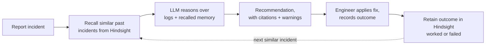

# IncidentMind

Incident-response assistant with a closed learning loop:
**Recall → Reason → Resolve → Verify → Retain → Recall next time.**

An LLM (Groq) reasons about the incident. [Hindsight](https://hindsight.vectorize.io/) supplies relevant
past experience and stores verified outcomes — **including fixes that failed** — so the same mistake is
never repeated twice.



## Run

```bash
# backend
cd backend
python -m venv .venv && source .venv/bin/activate
pip install -r requirements.txt
cp .env.example .env            # fill in HINDSIGHT_BASE_URL + GROQ_API_KEY for the real experience
uvicorn main:app --reload       # http://localhost:8000

# frontend (new terminal)
cd frontend
npm install
npm run dev                     # http://localhost:5173
```

With no keys set, the UI still works: the LLM falls back to a deterministic mock engine, and — only if you
set `USE_LOCAL_FALLBACK=true` — memory falls back to a local SQLite store. **By default, with no Hindsight
configured, recall returns nothing and says so** (`memory: unconfigured`) rather than quietly faking it.
The UI shows an amber banner in that case.

## How Hindsight is used

`backend/services/hindsight_service.py` isolates every SDK call in `_hs_retain`, `_hs_recall`, `_hs_reflect`
(checked against `hindsight-client==0.10.1`'s actual method signatures — run `scripts/smoke_hindsight.py`
against your own instance to confirm before a demo).

- **Retain** — every resolution attempt (worked *or* failed) is written as a structured record with
  `service`, `environment`, `result` as both `metadata` and `tags` (`service:redis-cache`, `result:failed`),
  so later recall can filter by service.
- **Recall** — queried with the incident's service, symptoms and logs; filtered server-side by
  `tags=["service:<service>"]`; pulls both `experience` and `observation` fact types.
- **Reflect** — generates cross-incident patterns for the "Reflect on all incidents" button and per-service
  runbooks (`GET /api/runbook/{service}.md`).
- Every retain also writes a local audit copy (not used for recall unless `USE_LOCAL_FALLBACK=true`), which
  the app uses to detect **conflicting** fixes (same fix, different outcomes) and **stale** memories
  (older than `STALE_DAYS`, default 90) — both surfaced as badges in the UI and passed to the LLM.

## Demo script

1. Click **Load demo history** — seeds ~12 resolved incidents across Redis, PostgreSQL, Kubernetes and
   Nginx, including a deliberate **conflict** (the same fix recorded as both working and failing for
   `redis-cache`) and one incident old enough to be flagged **stale**.
2. Report a Redis timeout incident: the memory panel shows the failed restart and the fix that worked, and
   the analysis tells you to skip the restart.
3. Click **Compare with/without memory** on that analysis to show the before/after, side by side — this is
   the moment that makes memory the star, not a feature.
4. Report a **Kafka consumer disconnecting** incident: memory is empty (Kafka is intentionally not seeded),
   the LLM reasons from logs alone.
5. Record the outcome (e.g. "Increase session.timeout.ms", it worked).
6. Report a second, similar Kafka incident: memory now recalls the first one and the recommendation cites it.
7. Click **Reflect on all incidents**, and export a runbook via the link on the resolution card.
8. Click **Reset demo** to start over with a brand-new Hindsight bank — no manual DB deletion needed.

## Known limitations

- Duplicate-incident detection is exact-match on service + symptoms text, not semantic.
- Conflict/staleness detection reads the local audit copy, not Hindsight's own fact store, since Hindsight
  has no "list all facts for a bank" call — this is a pragmatic index, not a second memory system.
- The mock LLM engine is deterministic and rule-based; it is not a substitute for testing with a real
  Groq key before the demo.
